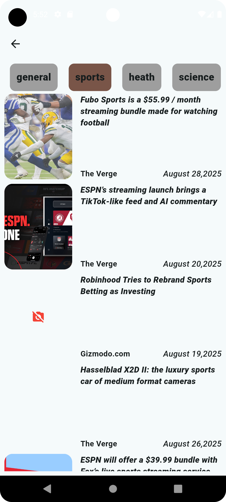

# 📰 NewsNest


[](https://flutter.dev/)
[](https://dart.dev/)
[](https://newsapi.org/)

A modern **Flutter News Application** that fetches the latest articles using the [NewsAPI](https://newsapi.org/).  
The app provides **real-time headlines, categories, and detailed article views** with a smooth and responsive UI.

---

## 🚀 Features
- 📌 **Latest News Feed** – Browse trending headlines in real-time
- 📂 **Categories** – Filter news by categories (Technology, Sports, Health, etc.)
- 📖 **Article Details** – View full details of selected news
- 🔄 **Pull-to-Refresh** – Get the latest news with a single swipe
- 🎨 **Responsive UI** – Works on both Android and iOS devices

---

## 🛠️ Tech Stack
- **Flutter** – Cross-platform framework
- **Dart** – Programming language
- **NewsAPI** – For fetching live news data
  

---

## 📸 Screenshots

### 🏠 Home Screen
  

### 📖 Details Screen
  

### 📂 Category Screen
  

---

## ⚙️ Setup & Installation

1. **Clone the repository**
   ```bash
   git clone https://github.com/sxjjad-Mehmood/NewsNest-.git
   cd newsapp
2. Get the dependencies
    flutter pub get
3. Run the app
   flutter run

---

##  🙌 Acknowledgements

NewsAPI
 for providing news data

Flutter
 for the amazing cross-platform framework
